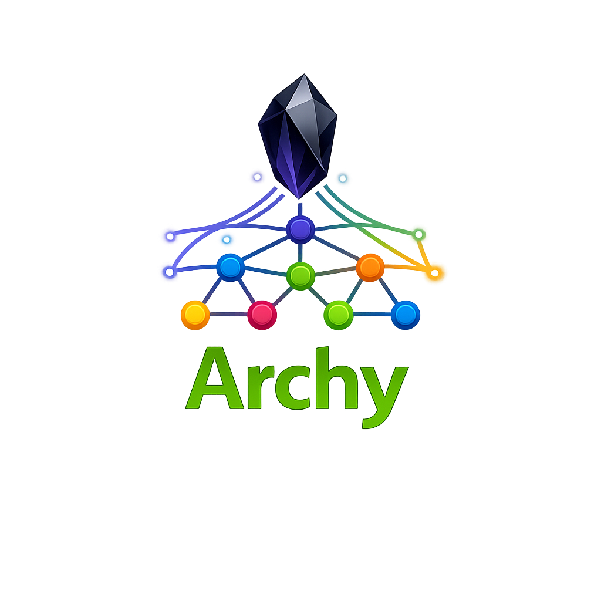
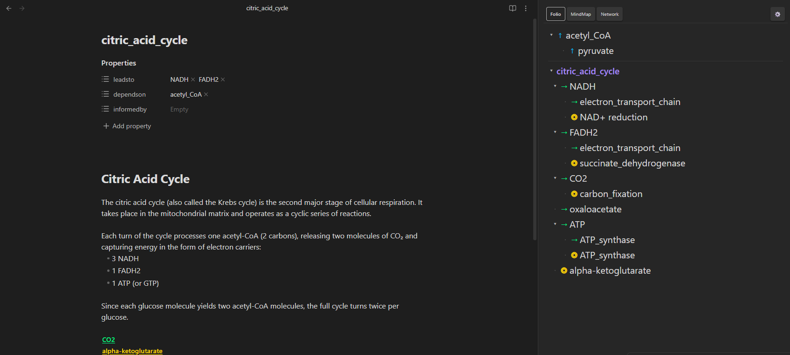
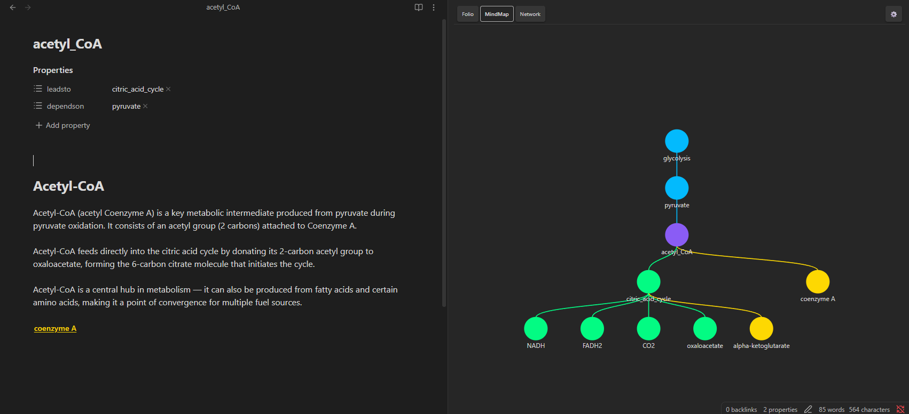
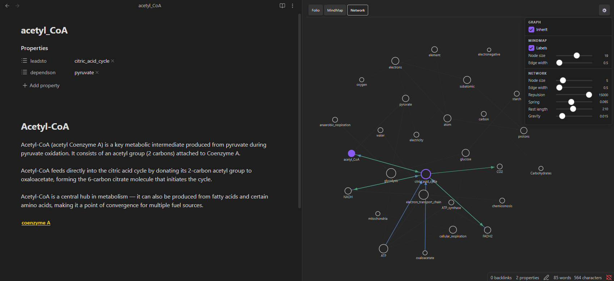

# Archy – Knowledge Graph

An Obsidian plugin for connecting notes through explicit, typed relationships — and visualizing them as an interactive tree, mindmap, or force-directed network.



---

## Overview

Archy gives you three relationship types to link your notes together:

| Tag | Shorthand | Direction | Meaning | Icon | Color |
|---|---|---|---|---|---|
| `leadsto` | `>@` | This note → another | A concept **flows into** something more specific or downstream | → | Green |
| `dependson` | `<@` | This note ↑ another | This note **requires** or is built upon another (a parent concept) | ↑ | Blue |
| `informedby` | `!@` | Terminal context | A fact, case study, or side-note that **enriches** this note without leading anywhere further | ◎ | Amber |

### The Cellular Respiration Example

- `glucose` is the upstream fuel source
- `glycolysis` **dependson** `glucose` and **leadsto** `pyruvate`
- `pyruvate` **leadsto** `acetyl_CoA`, which **leadsto** the `citric_acid_cycle`
- `citric_acid_cycle` **leadsto** `NADH` and `FADH2`, which both **leadsto** `electron_transport_chain`
- `electron_transport_chain` **leadsto** `ATP`
- `glycolysis` is **informedby** `anaerobic_respiration` (what happens without oxygen)

The Folio tree rooted at `cellular respiration` looks like:



---

## Installation

1. Copy the `archy-knowledge-graph` folder into your vault's `.obsidian/plugins/` directory
2. Open Obsidian → **Settings → Community Plugins**
3. If Safe Mode is on, turn it off
4. Find **Archy – Knowledge Graph** in the installed plugins list and toggle it **ON**

**Deployed files** (the only three files needed in production):

| File | Purpose |
|---|---|
| `main.js` | Compiled plugin code |
| `manifest.json` | Plugin metadata |
| `styles.css` | All visual styling |

The `src/`, `node_modules/`, `package.json`, `tsconfig.json`, and `esbuild.config.mjs` files are development-only and are not required in a deployed vault.

---

## How to Add Links

Archy supports **two equivalent ways** to define relationships. Both are read and merged — use whichever fits your workflow.

### Method 1 — Inline Tags (in the note body)

Write relationship tags anywhere in the body of your note. Two syntaxes are available:

**Full keyword syntax:**
```
Vinegar is a dilute solution of acetic acid. dependson@acetic_acid

When combined with oil and seasonings, it forms the base of many dressings. leadsto@vinaigrette

informedby@vinegaroon_defense
```

**Shorthand syntax** (identical meaning, fewer keystrokes):
```
Vinegar is a dilute solution of acetic acid. <@acetic_acid

When combined with oil and seasonings, it forms the base of many dressings. >@vinaigrette

!@vinegaroon_defense
```

| Shorthand | Equivalent | Meaning |
|---|---|---|
| `>@NoteName` | `leadsto@NoteName` | This note leads to NoteName |
| `<@NoteName` | `dependson@NoteName` | This note depends on NoteName |
| `!@NoteName` | `informedby@NoteName` | This note is informed by NoteName |

**Rules:**
- The target must be the note's exact **filename** (without `.md`)
- For filenames **with spaces**, wrap the name in double quotes: `leadsto@"note name with spaces"`
- For filenames without spaces, no quotes are needed: `leadsto@my_note`
- Both shorthand and full-keyword forms support quoted names
- Tags can appear anywhere: in prose, bullet lists, callouts, headings, anywhere inline or on their own line
- The `@` must directly follow the keyword or shorthand with no gaps: ✅ `leadsto@vinaigrette` ❌ `leadsto@ vinaigrette`

**Quoted name examples:**
```
This concept requires a foundational understanding. dependson@"linear algebra"

>@"citric acid cycle"

!@"pyruvate dehydrogenase complex"
```

### Method 2 — Frontmatter (YAML)

Add relationship arrays to the note's YAML frontmatter block:

```yaml
---
dependson:
  - acetic_acid
leadsto:
  - vinaigrette
informedby:
  - vinegaroon_defense
---
```

Inline YAML lists are also valid:
```yaml
---
leadsto: [vinaigrette, salad_dressing]
dependson: [acetic_acid]
---
```

> Both methods are read simultaneously and deduplicated. Links defined in both the frontmatter and the body are merged into a single list — no duplicates appear in the tree.

---

## Inline Tag Chips

Inline tags are rendered as **clickable colored chips** in both Live Preview and Reading View:

- In **Live Preview** (editor), tags are automatically replaced with styled chips as you type. Moving your cursor into a tag reveals the raw text for editing.
- In **Reading View**, all tags are rendered as chips.
- Clicking any chip navigates directly to that note.

The chips are color-coded to match the tree view: green for `leadsto`, blue for `dependson`, amber for `informedby`.

---

## Inserting Links via Command Palette

Instead of typing tags by hand, use the built-in **Insert Link** commands:

1. Open the Command Palette (`Ctrl+P` / `Cmd+P`)
2. Type **Archy** to filter the commands:

| Command | Action |
|---|---|
| `Archy: Insert Link (choose type)` | Opens a modal — pick link type and target note |
| `Archy: Insert leadsto link` | Opens modal pre-set to *leadsto* |
| `Archy: Insert dependson link` | Opens modal pre-set to *dependson* |
| `Archy: Insert informedby link` | Opens modal pre-set to *informedby* |
| `Archy: Open Knowledge Tree` | Opens the Archy tree panel |

The modal includes **autocomplete** from all notes in your vault. The selected link is written directly into the active note's frontmatter as a YAML array entry.

---

## The Knowledge Tree Panel

Click the **fork icon** in the ribbon (or use the command `Open Knowledge Tree`) to open the **Archy Tree** panel.

The panel always reflects the **currently active note** and updates automatically whenever you switch notes or save changes.

Three view modes are available via the buttons at the top of the panel:

---

### Folio View

A collapsible **tree list** rooted at the active note.


- **Ancestor section** (above the divider): notes that declare `leadsto` pointing at the current note, up to the configured *Parent Depth*. These are the notes the current note "depends on" in its knowledge hierarchy.
- **Root + children** (below the divider): `leadsto` and `informedby` children, expanding outward to the configured *Child Depth*.
- **Bidirectional inference**: if Note A has `leadsto: [B]`, then B automatically shows A as a parent — you never need to declare both sides.
- Click **▾/▸** triangles to collapse or expand any branch.
- Click any note name to open it.

---

### MindMap View

An **SVG mindmap** centered on the active note, with ancestors fanning upward and children fanning downward.

- Nodes are colored circles: root in accent color, children in green (leadsto) or amber (informedby), parents in blue (dependson).
- Node labels are hidden by default; **hover** over a node to reveal its name. Enable **Labels** in the settings panel to show all names at once.
- **Click** any node to open that note.
- **Click and drag** to pan the view.
- **Scroll** to zoom in and out (zooms toward the cursor position).
- Pan and zoom are preserved when adjusting display settings.


---

### Network View

A **force-directed graph** of your entire vault — all notes and all relationships simultaneously.

- Nodes are sized by connection count (more connections = larger circle). The active note is highlighted in accent color.
- All edges start **dimmed** to reduce visual clutter.
- **Hover over any node** to reveal the colored edges connected to it (green = leadsto, blue = dependson, amber = informedby), with directional arrowheads.
- **Click** any node to open that note.
- **Click and drag** to pan the view.
- **Scroll** to zoom in and out.
- The simulation runs a Verlet spring physics animation and gradually settles into a stable layout.
- Pan and zoom are preserved when adjusting display settings.



---

## Display & Physics Settings

Click the **⚙** button at the right of the view toolbar to open the settings dropdown. Changes take effect immediately without resetting your pan/zoom position.

### Graph

| Setting | Description |
|---|---|
| **Inherit** | Apply transitive reduction to the graph. If `A→B`, `A→C`, and `B→C` all exist, the direct `A→C` edge is redundant — it is already implied through B. Enabling Inherit removes such redundant edges so only the minimal connection set is shown. |

### MindMap

| Setting | Default | Description |
|---|---|---|
| **Labels** | Off | Always show node name labels (default: hover to reveal) |
| **Node size** | 14 | Radius of each node circle |
| **Edge width** | 1.5 | Stroke width of the connecting curves |

### Network

| Setting | Default | Description |
|---|---|---|
| **Node size** | 7 | Base radius of each node circle (larger nodes for high-degree notes) |
| **Edge width** | 1.2 | Stroke width of edge lines |
| **Repulsion** | 5500 | Strength of the node–node repulsion force — higher values spread nodes further apart |
| **Spring** | 0.03 | Stiffness of the edge springs — higher values pull connected nodes closer together |
| **Rest length** | 120 | Target edge length at rest (pixels in graph space) |
| **Gravity** | 0.03 | Strength of the pull toward the center of the graph — prevents nodes from drifting away |

---

## Plugin Settings

Go to **Settings → Archy – Knowledge Graph**:

| Setting | Default | Range | Description |
|---|---|---|---|
| Panel side | Right | Left / Right | Which sidebar the Archy panel opens in |
| Default view mode | Folio | Folio / MindMap / Network | The view shown when the panel first opens |
| Child depth | 4 | 1–8 | How many levels of `leadsto`/`informedby` children to display in Folio and MindMap views |
| Parent depth (Folio) | 2 | 1–6 | How many ancestor levels to show above the root note in Folio view |
| Folio font size | 13 | 8–24 px | Font size for the Folio tree list |

---

## Relationship Philosophy

| Type | Think of it as… | Example |
|---|---|---|
| `leadsto` | "This concept flows into…" | `glycolysis` leadsto `pyruvate` |
| `dependson` | "I am built on top of…" | `glycolysis` dependson `glucose` |
| `informedby` | "An enriching side-note…" | `glycolysis` informedby `anaerobic_respiration` |

`informedby` notes are **terminal by design** — they provide color and context but don't need to lead anywhere further. Think of them as your knowledge's "fun facts" layer.

`leadsto` and `dependson` are **inverses** of each other. If A `leadsto` B, then B automatically `dependson` A (inferred in memory — your files are never modified). This means you only ever need to declare one direction, and the tree will show the correct hierarchy from either note's perspective.

**Inherit / Transitive Reduction:** If your graph has `A→B→C` and also a direct `A→C`, turning on Inherit removes the redundant `A→C` edge — the connection is already implied through B. This cleans up dense graphs and makes the hierarchy easier to read.

---

## Note Naming Tips

- Note names in tags must exactly match the **filename** without `.md`
- Names are case-sensitive on most systems
- For filenames with spaces, use double-quoted syntax: `leadsto@"my note name"`
- Underscores or hyphens are also supported in unquoted tags: `leadsto@my-note`, `leadsto@my_note`
- The Insert Link modal shows exact filenames from your vault with autocomplete, so you don't have to remember the exact casing

---

## License

MIT © 2026 Brandon Thomas Hendrickson
